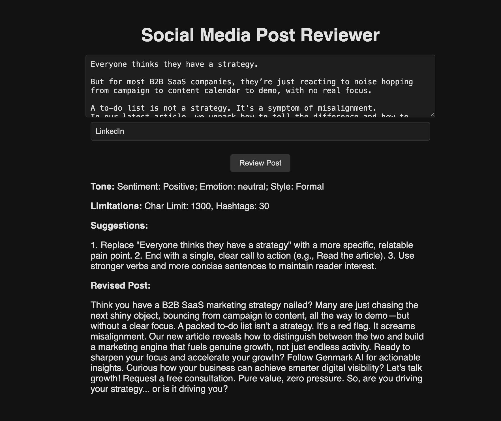
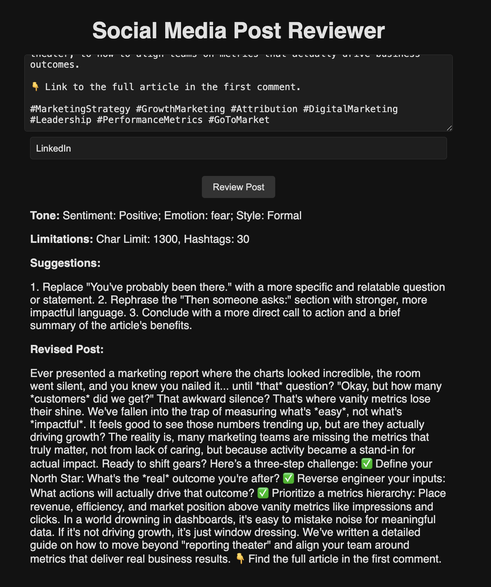
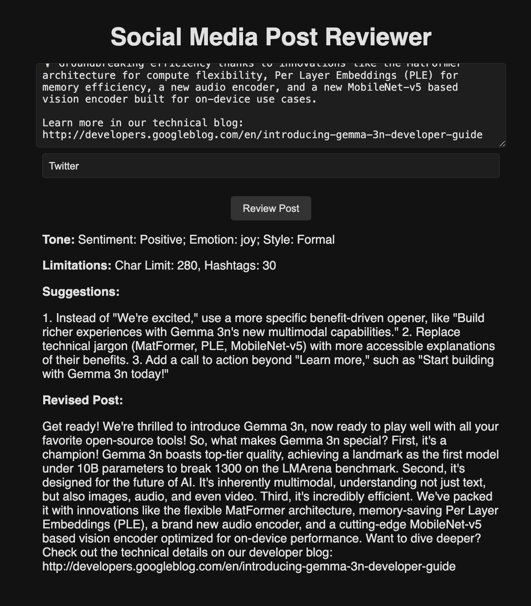

# Social Media Post Reviewer

## Prerequisites
- Node.js ≥ 16  
- Python 3.9+  

## Setup Instructions
Run ```git clone https://github.com/agdhruv14/Social-Media-Assistant``` in an IDE to get the files, then follow the below instructions to run both the backend and front-end (in seperate terminals)<br>
Click on the link in the front-end or navigate to ```localhost:5173```.

### Frontend
```bash
cd client
npm i
npm run dev
```

### Backend
Note that to download the model for NLP it may take 1-2 minutes when first running the app
```bash
cd server
python -m venv venv
source venv/bin/activate
pip install -r requirements.txt
python app.py
```

## What I accomplished
This was a short project to build out a simple web-app that takes in input and uses NLP, Gemini API and logic to suggest improvements and a revised post.

## What I would do with more time
The next step would be scaling up the features: 
- Adding different analysis based on the different platforms (potentially using RAG to feed a model custom data)
- Improving the backend structure, seperating functions, creating a seperate file for gemini_controller with a larger, improved system prompt 
- Linking to a NoSQL database to store version history and requesting multiple revisions on the same post


## Demo
Genmark AI most recent LinkedIn post

Genmark AI reposted on LinkedIn

Google AI most recent Twitter post